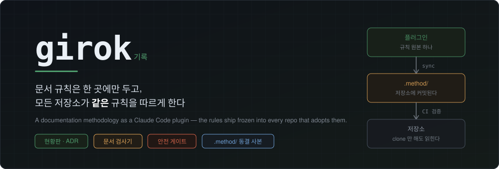
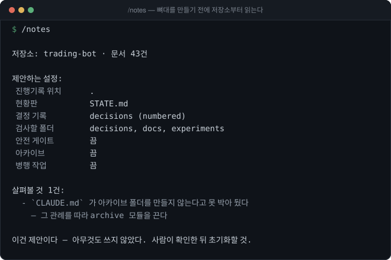
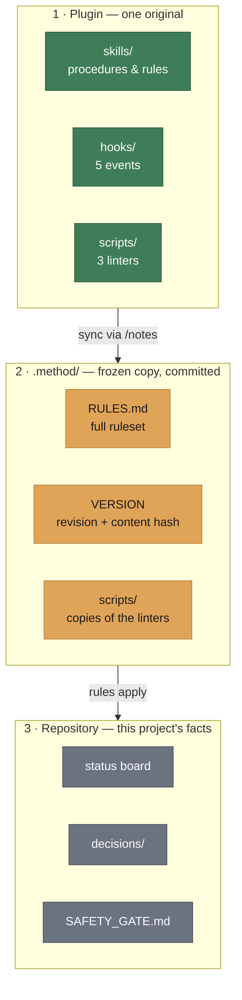
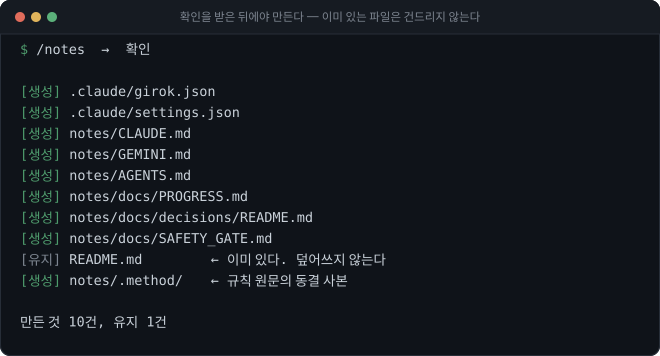
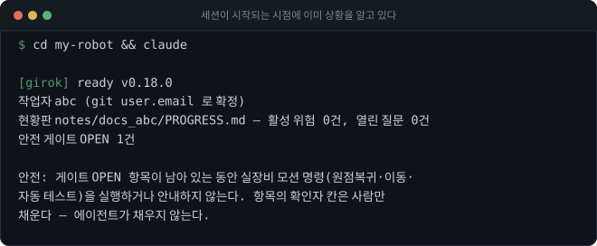
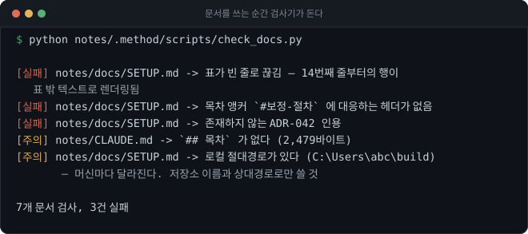
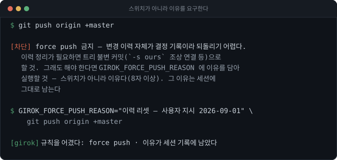

<p align="center">
  
</p>

<p align="center">
  Notes split into a <strong>status board · decision records (ADR) · archive</strong>, with a linter that catches the mistakes people actually make.<br>
  Projects that drive real hardware get a safety gate <strong>an agent cannot close</strong>.
</p>

<p align="center">
  <a href="../README.md">한국어</a> ·
  <a href="README.en.md">English</a>
</p>

<p align="center">
  <a href="https://github.com/mongdang/girok/actions/workflows/tests.yml"></a>
  <a href="https://github.com/mongdang/girok/blob/master/.claude-plugin/plugin.json"></a>
  <a href="../LICENSE"></a>
  
  
</p>

<p align="center">
  
</p>

<p align="center">
  <sub>Adoption is one <code>/notes</code>. It <b>reads the repository before it writes anything</b> and infers the configuration from conventions you already use.<br>
  <i>Screenshots are real output — which the plugin prints in Korean.</i></sub>
</p>

> [!NOTE]
> The plugin's own console output and shipped documents are Korean. This page is the English
> guide to what it does and how to run it. Everything described here works the same in any
> language — the linter, the hooks and the safety gate are language-agnostic.

---

## Contents

- [Why this exists](#why-this-exists)
- [How it works](#how-it-works)
- [Quick start](#quick-start)
- [What ships](#what-ships)
- [What is blocked and what is warned](#what-is-blocked-and-what-is-warned)
- [Configuration](#configuration)
- [Does it touch my files](#does-it-touch-my-files)
- [What it does not do](#what-it-does-not-do)
- [Requirements](#requirements)
- [License](#license)

---

## Why this exists

Writing down a documentation convention is the easy part. The trouble starts the moment you
**copy it into a second repository**.

Here is what actually happened in the project this plugin came out of. A check for "a GFM
table broken by a blank line" was added to the linter — after that same mistake had already
caused three incidents. That improvement **never reached the other repositories.** Nobody
noticed. Nothing was watching.

Copies drift. That is not a problem carefulness solves; it is a problem structure solves.

## How it works

The rules live in exactly one place — the plugin. Each repository gets a **frozen copy of
that revision committed into it**, so the full ruleset is readable from a plain `git clone`
with no plugin installed.



Layer 2 is where this parts ways with a normal plugin.

| | |
|---|---|
| **A clone is enough** | Reading `.method/RULES.md` needs no plugin. Gemini CLI and Codex read the same file |
| **The revision is in the history** | `.method/VERSION` is committed alongside the work the rules governed |
| **Drift is visible** | At session start the snapshot is compared against the installed plugin revision |
| **CI enforces it** | The snapshot must be **byte-identical** to the output of the revision `VERSION` names |

> [!IMPORTANT]
> Nobody edits `.method/` by hand. Revise the plugin original and sync it down. Editing the
> copy makes it drift again — which is the exact problem this project removes.

## Quick start

### 1 · Install the plugin (once per machine)

```bash
claude plugin marketplace add mongdang/girok
claude plugin install girok@mongdang
```

Then **restart Claude Code** — hooks attach when a session starts.

### 2 · Adopt it in a repository (once per repository)

```
/notes
```

`/notes` **reads the repository before it builds anything.** It infers the configuration from
conventions already in use — which file is the status board, where decision records live,
which documents are over the size limit — and reports what it found. This step is read-only,
and its output is a proposal.

It asks for confirmation before creating anything.

<p align="center">
  
</p>

Commit the result. `.claude/settings.json` in particular has to be committed for teammates to
pick up the plugin declaration.

### 3 · Work

```bash
cd <repository>
claude
```

That is the whole workflow — there is no command to type. By the time the session starts, the
rule revision, the current worker, the state of the status board and any open gate items are
already in context.

<p align="center">
  
</p>

## What ships

| Skill | Covers |
|---|---|
| `project-notes` | Session procedure, which document holds what, commit and push rules |
| `progress-board` | Keeping the board a **snapshot of the present**, not an append-only log |
| `writing-adr` | What counts as a decision, the card format, the supersede procedure |
| `doc-style` | Document structure, callouts, status badges, tables, images |
| `parallel-docs` | Per-worker folders, stamps, incoming scans, merge order |
| `safety-gate` | Gate items, marker rules, deployment records *(optional module)* |

| Hook | Does |
|---|---|
| `SessionStart` | Runs the checks **for** you and injects the result |
| `UserPromptSubmit` | Surfaces open gate items the moment motion or homing comes up |
| `PreToolUse` | Blocks only what is worth blocking; warns about the rest |
| `PostToolUse` | Lints the document you just wrote and refreshes its modified stamp |
| `Stop` | Unpushed commits, missing log entry for today, documents still failing |

| Linter | Catches |
|---|---|
| `check_docs.py` | Dead TOC anchors · tables broken by a blank line · lone carriage returns · citations of non-existent decisions · missing index entries · missing TOC · documents starting with `---` · CLOSED gate items with no verifier or date · local absolute paths · oversized documents |
| `marker_scan.py` | `SAFETY-STUB` and `VIRTUAL-BYPASS` markers not registered in the gate |
| `method_sync.py` | Creating and verifying the `.method/` snapshot |
| `notes_survey.py` | Pre-adoption survey — infers configuration, reports cleanup (read-only) |
| `notes_adopt.py` | Migrating existing notes into girok's layout — `backup` · `plan` · `apply` · `verify` |

<p align="center">
  
</p>

The linters run **from the committed snapshot**, so CI needs nothing installed:

```bash
python <notes>/.method/scripts/check_docs.py
python <notes>/.method/scripts/marker_scan.py
python <notes>/.method/scripts/method_sync.py verify
```

A ready-made workflow is in [`ci/github-actions.yml`](../ci/github-actions.yml). Hooks are the
fast feedback; **CI is the guarantee** — people without the plugin, other agents and web-UI
edits all walk straight past the hooks.

## What is blocked and what is warned

Blocking is reserved for **two categories only: safety, and destroying history.** Everything
else is a warning. A check that blocks ordinary work eventually gets turned off, and a check
that is off protects nothing.

| | Action | Why |
|---|---|---|
|  | Hardware motion commands while a gate item is OPEN | The cost of an accident is not comparable to the convenience |
|  | An agent filling in the gate's **verifier field** | An AI cannot stand in for physical verification |
|  | Adding a marker without registering it in the same commit | Keeps unregistered safety bypasses out of the history |
|  | `--force` push — **including the `+refspec` form** | History is itself a decision record. Give a reason and it passes (below) |
|  | Pushing to a reference-only repository | It is a source to compare against, not to write to |
|  | Editing `.method/` directly | Touch it and the copy drifts again |
|  | Writing notes, committing or pushing with the worker unresolved | The wrong id ends up merged into someone else's notes |
|  | Writing to the shared `docs/` during parallel work | Exceptions: the safety gate, mechanical fixes |
|  | A new local absolute path in a document | It differs on every machine |
|  | A document over its size limit | Time to move the finished narrative into the archive |

### When you have to break the rule

Force push is blocked. If you genuinely need it, run it **with a reason**:

<p align="center">
  
</p>

```bash
GIROK_FORCE_PUSH_REASON="history reset — instructed 2026-09-01" git push origin +master
```

A reason, not a switch (at least 8 characters). The hook writes that reason into the session,
so both the fact that a rule was broken and the grounds for it stay on the record.

> [!NOTE]
> `+master` is a force push too. The first version only caught the flag, and the guard was
> walked straight through in this form — a hole only the author knows about is worse than no
> guard at all.

## Configuration

Everything that differs per project lives in one committed file, `.claude/girok.json`.

```json
{
  "notesDir": "notes",
  "workers": { "abc": "abc@example.com" },
  "mergeOwner": "abc",
  "modules": { "safetyGate": true, "archive": true },
  "limits": { "rulesKB": 20, "boardKB": 30 },
  "parallelMode": true,
  "readOnlyRepos": []
}
```

| Key | Default | Meaning |
|---|---|---|
| `notesDir` | `"notes"` | Where the notes tree lives. `"."` means the repository root |
| `board` | `"PROGRESS.md"` | Status board filename |
| `decisionsDir` | `"docs/decisions"` | Decision-record folder |
| `docRoots` | `["docs"]` | Folders linted recursively |
| `rootDocs` | `["CLAUDE.md", "RULES.md"]` | Documents linted **non-recursively** at the notes root |
| `adrStyle` | `"adr-prefixed"` | `ADR-NNN-slug.md`; `"numbered"` gives `NNN-slug.md` |
| `workers` | `{}` | worker id → git email. **Empty blocks note writes and commits** |
| `mergeOwner` | `null` | Who merges to master and pushes |
| `modules.safetyGate` | `true` | Turn off for projects with no hardware |
| `modules.archive` | `true` | Turn off if your convention is "deleted things live in git history" |
| `parallelMode` | `true` | Turn off for a solo repository |
| `readOnlyRepos` | `[]` | Repositories push is blocked to |
| `skipDirs` | `[]` | Folders the linter skips — for frozen output predating adoption |

The layout is configuration, not an assumption: the second repository to adopt this had a
different one, and renaming 52 decision files cost more than it was worth.

## Does it touch my files

The first question every time, so here is every write path.

| Target | Answer |
|---|---|
| **Source code** | Never. There is no code path that writes code |
| **Existing documents** | **Never overwritten.** Initialization reports `[kept]` and moves on |
| **Existing folder structure** | Unchanged. If a config file exists, its layout wins |
| **git history** | No commits, pushes or resets. git is used read-only (`config`, `rev-parse`, `rev-list`, `diff --cached`) |

The only folder it deletes is `<notes>/.method/`, which sync rebuilds — and it refuses to
delete one it cannot confirm it created, via `VERSION`.

The only existing document it edits is the one-line `> last modified:` stamp on parallel-managed
documents, only where that line already exists, preserving the file's CRLF/LF style.

Initialization creates nothing without `--confirm <repository folder name>`. Whether a
repository is reference-only is not written anywhere inside it, so the caller has to name the
repository it means to write to.

## What it does not do

More important than the feature list.

- **It does not close safety gate items.** Only a human verifier does. The hooks block the
  attempt to fill in the verifier field at all.
- **It does not merge without approval.** Automatic document merging is deliberately deferred —
  that is where the risk is, and it is unrelated to the problem this solves.
- **It does not save you from yourself.** Hooks only see paths an agent executes. A human moving
  an axis from the machine's own console is not covered by anything here.
- **It does not decide what to record.** Only where it goes and in what shape.

## Requirements

**Python 3.10+** and **git**. That is all.

Hooks and linters are Python; the entry point is a polyglot wrapper that runs under bash,
cmd.exe and PowerShell alike — all three measured, including Claude Code launching hooks
through PowerShell on a Windows machine with no Git Bash. The wrapper does not pick an
interpreter by name; it **executes candidates to check**. On Windows `python3` usually
resolves to a Microsoft Store stub rather than an interpreter, and picking it once made every
hook die silently.

CI runs on Linux and Windows. Line endings, console encoding and interpreter discovery all
behaved differently across the two, and the tests found the differences before users did.

## License

MIT — [LICENSE](../LICENSE)
